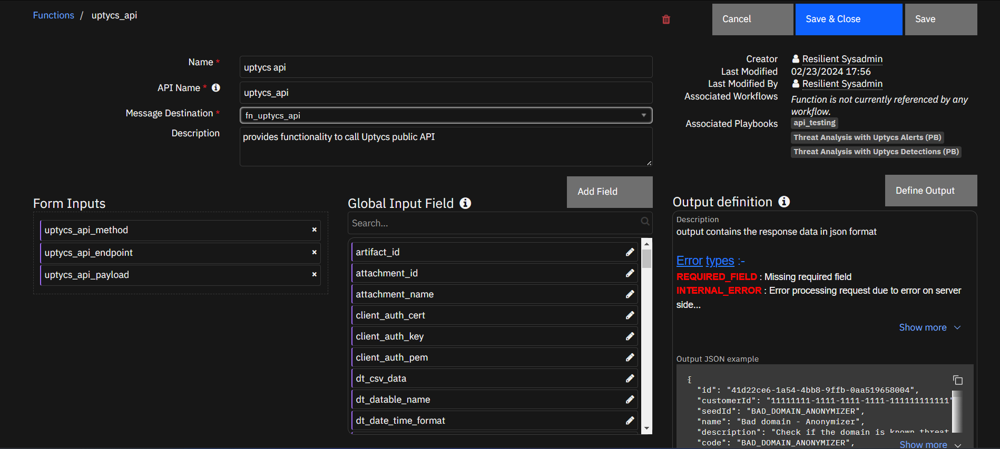

# Threat Analysis with Uptycs

## Release Notes

| Version | Date    | Notes                       |
| ------- | ------- | --------------------------- |
| 1.0.0   | 03/2024 | Initial Release             |
| 1.1.0   | 05/2024 | Supports All Resource Types |

---

## Overview

**Responds to threats everywhere across the cloud, endpoints, containers, and K8s systems**

 

It is a robust extension that seamlessly integrates with the Uptycs platform to retrieve real-time alerts data and analyze potential security threats.

    This integration empowers security teams to proactively monitor, analyze, and respond to security incidents within their organization's IT infrastructure, ensuring timely detection and mitigation of threats.

### Key Features

* Retrieve Uptycs data into the IBM QRADAR SOAR
* Threat Analysis on Uptycs Data (both alerts and detections)
* Automating the threat analysis process with uptycs alerts and detections

---

## Requirements

This app supports the IBM Security QRadar SOAR Platform and the IBM Security QRadar SOAR for IBM Cloud Pak for Security.

### SOAR platform

The SOAR platform supports two app deployment mechanisms, App Host and integration server.

If deploying to a SOAR platform with an App Host, the requirements are:

* SOAR platform >= `50.0.9097`.
* The app is in a container-based format (available from the AppExchange as a `zip` file).

If deploying to a SOAR platform with an integration server, the requirements are:

SOAR platform >= `50.0.9097`.

The app is in the older integration format (available from the AppExchange as a `zip` file which contains a `tar.gz` file).

Integration server is running `resilient-circuits>=51.0.1.0.0`.

If using an API key account, make sure the account provides the following minimum permissions:

| Name     | Permissions |
| -------- | ----------- |
| Org Data | Read        |
| Function | Read        |

The following SOAR platform guides provide additional information:

* _App Host Deployment Guide_: provides installation, configuration, and troubleshooting information, including proxy server settings.
* _Integration Server Guide_: provides installation, configuration, and troubleshooting information, including proxy server settings.
* _System Administrator Guide_: provides the procedure to install, configure and deploy apps.

The above guides are available on the IBM Documentation website at [ibm.biz/soar-docs](https://ibm.biz/soar-docs). On this web page, select your SOAR platform version. On the follow-on page, you can find the _Edge Gateway Deployment Guide_, _App Host Deployment Guide_, or _Integration Server Guide_ by expanding **Apps** in the Table of Contents pane. The System Administrator Guide is available by expanding **System Administrator**.

### Cloud Pak for Security

If you are deploying to IBM Cloud Pak for Security, the requirements are:

* IBM Cloud Pak for Security >= `1.10.15`.
* Cloud Pak is configured with an Edge Gateway.
* The app is in a container-based format (available from the AppExchange as a `zip` file).

The following Cloud Pak guides provide additional information:

* _App Host Deployment Guide_: provides installation, configuration, and troubleshooting information, including proxy server settings. From the Table of Contents, select Case Management and Orchestration & Automation > **Orchestration and Automation Apps**.
* _System Administrator Guide_: provides information to install, configure, and deploy apps. From the IBM Cloud Pak for Security IBM Documentation table of contents, select Case Management and Orchestration & Automation > **System administrator**.

These guides are available on the IBM Documentation website at [ibm.biz/cp4s-docs](https://ibm.biz/cp4s-docs). From this web page, select your IBM Cloud Pak for Security version. From the version-specific IBM Documentation page, select Case Management and Orchestration & Automation.

### Proxy Server

Proxies supported if running on AppHost >= 1.6

### Python Environment

Python 3.11 or later versions are supported.
Additional package dependencies may exist for each of these packages:

* resilient-circuits>=51.0.1.0.0
* requests>=2.31.0

## Installation

### Install

* To install or uninstall an App or Integration on the _SOAR platform_, see the documentation at [ibm.biz/soar-docs](https://ibm.biz/soar-docs).
* To install or uninstall an App on _IBM Cloud Pak for Security_, see the documentation at [ibm.biz/cp4s-docs](https://ibm.biz/cp4s-docs) and follow the instructions above to navigate to Orchestration and Automation.

### App Configuration

The following table provides the settings you need to configure the app. These settings are made in the app.config file. See the documentation discussed in the Requirements section for the procedure.

| Config                         | Required | Example                               | Description                        |
| ------------------------------ | :------: | ------------------------------------- | ---------------------------------- |
| **uptycs_api_key**       |   Yes   | `<key_value_of_uptycs_api_keys>`    | key value of Uptycs API keys       |
| **uptycs_api_secret**    |   Yes   | `<secret_value_of_uptycs_api_keys>` | secret value of Uptycs API Keys    |
| **uptycs_customer_id**   |   Yes   | `<uptycs_customer_id>`              | Your Uptycs Customer ID            |
| **uptycs_domain**        |   Yes   | `<domain_name_of_uptycs_stack>`     | Domain of your Uptycs Stack        |
| **uptycs_domain_suffix** |   Yes   | `<domain_suffix_of_uptycs_stack>`   | Domain Suffix of your Uptycs Stack |

---

## Function - uptycs api

provides functionality to call Uptycs public API



<details><summary>Inputs:</summary>
<p>

| Name                    |   Type   | Required | Example | Tooltip                   |
| ----------------------- | :------: | :------: | ------- | ------------------------- |
| `uptycs_api_endpoint` | `text` |   Yes   | `-`   | API Endpoint to be called |
| `uptycs_api_method`   | `text` |   Yes   | `-`   | Request method for an API |
| `uptycs_api_payload`  | `text` |   Yes   | `-`   | Payload for the API call. |

</p>
</details>

<details><summary>Outputs:</summary>
<p>

> **NOTE:** This example might be in JSON format, but `results` is a Python Dictionary on the SOAR platform.

```python
results = {
  "items": [
    {
      "alertConfig": {},
      "alertNotifyCount": null,
      "alertNotifyInterval": null,
      "alertRuleExceptions": [],
      "alertRuleQueries": [],
      "alertTags": [
        "ANONYMIZER",
        "DOMAIN",
        "THREAT-INTEL",
        "UPTYCS"
      ],
      "code": "BAD_DOMAIN_ANONYMIZER",
      "createdAt": "2023-05-15T20:53:06.519Z",
      "createdBy": "00000000-0000-0000-0000-000000000000",
      "custom": false,
      "customerId": "11111111-1111-1111-1111-111111111111",
      "description": "Check if the domain is known threat and is categorized as Anonymizer",
      "destinations": [],
      "enabled": true,
      "grouping": "Threat Intel",
      "groupingL2": "Threat Intel",
      "groupingL3": "Threat Intel",
      "groupingL4": null,
      "id": "41d22ce6-1a54-4bb8-9ffb-0aa519658004",
      "isInternal": false,
      "links": [
        {
          "href": "/api/customers/11111111-1111-1111-1111-111111111111/alertRules/41d22ce6-1a54-4bb8-9ffb-0aa519658004",
          "rel": "self",
          "title": "Alert rule"
        },
        {
          "href": "/api/customers/11111111-1111-1111-1111-111111111111/alertRules",
          "rel": "parent",
          "title": "Alert rules"
        }
      ],
      "lock": false,
      "name": "Bad domain - Anonymizer",
      "potentialImpact": null,
      "remediationSteps": null,
      "rule": "Auto create alert rule for Bad domain - Anonymizer",
      "scriptConfig": null,
      "seedId": "BAD_DOMAIN_ANONYMIZER",
      "sqlConfig": null,
      "throttled": false,
      "timeSuppressionDuration": null,
      "timeSuppressionStart": null,
      "type": "builder",
      "updatedAt": "2023-05-15T20:53:06.522Z",
      "updatedBy": "00000000-0000-0000-0000-000000000000"
    }
  ],
  "limit": 1,
  "links": [
    {
      "href": "/api/customers/11111111-1111-1111-1111-111111111111/alertRules",
      "rel": "self"
    },
    {
      "href": "/api/customers/11111111-1111-1111-1111-111111111111",
      "rel": "parent"
    },
    {
      "href": "/public/api/customers/11111111-1111-1111-1111-111111111111/alertRules?limit=1\u0026offset=1",
      "rel": "next",
      "title": "Next page"
    }
  ],
  "offset": 0
}
```

</p>
</details>

<details><summary>Example Function Input Script:</summary>
<p>

```python
import json

# unique id of the detection
detectionID = incident.properties.uptycs_detection_id


# API endpoint
endpoint = f"/detections/{detectionID}"


inputs.uptycs_api_method = 'GET'
inputs.uptycs_api_endpoint = endpoint
inputs.uptycs_api_payload = json.dumps({})


```

</p>
</details>

<details><summary>Example Function Post Process Script:</summary>
<p>

```python
"""
Set Detection data to playbook property named "json_data" to get the corresponding Rich Text HTML Code
"""

jsonData = {
   "heading": "Uptycs Detection Data",
   "content": playbook.functions.results.detectiondata.content
}


playbook.addProperty('json_data', jsonData)


```

</p>
</details>

---

## Script - JSON TO HTML (RICH TEXT)

Converts provided JSON Data to Rich Text and adds it as a note to the corresponding Incident

**Object:** incident

<details><summary>Script Text:</summary>
<p>

```python
"""
Set the Json Data that you would like to convert to rich text in a playbook property called "json_data" using playbook.addProperty('json_data', JSON_DATA)

JSON_DATA should have two keys, heading and content.

ex: JSON_DATA = {
   "heading" : "Uptycs Alert Data",
   "content" : {},   =======> json object
}

It converts the provided json to rich text and adds that as a note to the corresponding incident.

Go to Notes Tab to observe the corresponding Rich Text View of the JSON DATA.

"""


""" Don't Modify below lines of code """

def json_to_rich_text(data, initial_padding, padding=10):

    html = ""

    if isinstance(data, dict):
        for key, value in data.items():
            if isinstance(value, dict):
                html += "<strong style='padding-left:{0}px; color: #3366cc;'>{1}</strong>:<br><strong style='padding-left:{0}px; color: #1adf17;'>{{</strong><br>{2}<strong style='padding-left:{0}px; color: #1adf17;'>}}</strong>,<br>".format(
                        initial_padding, key,json_to_rich_text(value, initial_padding + padding, padding)
                        )
            elif isinstance(value, list):
                if len(value) == 0:
                    html += "<strong style='padding-left:{0}px; color: #993333;'>{1}</strong>: [ ]<span style='color: #1adf17;'>,</span> <br>".format(initial_padding, key)
                else:
                    html += "<strong style='padding-left:{0}px; color: #3366cc;'>{1}</strong>:<br><strong style='padding-left:{0}px; color: #1adf17;'>[</strong><br>{2}<strong style='padding-left:{0}px; color: #1adf17;'>]</strong>,<br>".format(
                            initial_padding, key, json_to_rich_text(value, initial_padding + padding, padding)
                            )
            else:
                html += "<strong style='padding-left:{0}px; color: #993333;'>{1}</strong>: {2}".format(
                        initial_padding, key,
                        json_to_rich_text(value, 5, padding)
                        )
    elif isinstance(data, list):
        for item in data:
            if isinstance(item, dict):
                html += "<br><strong style='padding-left:{0}px; color: #1adf17;'>{{</strong><br>{1}<strong style='padding-left:{0}px; color: #1adf17;'>}}</strong><br>".format(
                        initial_padding,
                        json_to_rich_text(item, initial_padding, padding)
                        )
            elif isinstance(item, list):
                html += "<br><strong style='padding-left:{0}px; color: #1adf17;'>[</strong><br>{1}<strong style='padding-left:{0}px; color: #1adf17;'>]</strong><br>".format(
                        initial_padding,
                        json_to_rich_text(item, initial_padding, padding)
                        )
            else:
                html += json_to_rich_text(item, initial_padding, padding)
    else:
        html += "<span style='padding-left:{0}px;'>{1}</span><span style='color: #1adf17;'>,</span><br>".format(initial_padding, data)
    return html


inputObject = playbook.properties.json_data

heading = inputObject.heading
jsonData = inputObject.content

htmlData = json_to_rich_text(jsonData, 20, 41)

header = f"<H1 style='margin: 20px 0; color:#FF3312; text-align: center;'>{heading}</H1>"

htmlData = header + htmlData

incident.addNote(helper.createRichText(htmlData))

```

</p>
</details>

---

## Playbooks

| Playbook Name                               | Description                                                                    | Activation Type | Object   | Status      | Condition |
| ------------------------------------------- | ------------------------------------------------------------------------------ | --------------- | -------- | ----------- | --------- |
| Threat Analysis with Uptycs Alerts (PB)     | sample playbook for collecting alert data from Uptycs into the IBM QRADAR SOAR | Manual          | incident | `enabled` | `-`     |
| Threat Analysis with Uptycs Detections (PB) | sample playbook to retrieve detection data and analyse on the data             | Manual          | incident | `enabled` | `-`     |

---

## Custom Layouts

* Import the Data Tables and Custom Fields like the screenshot below:

  

## Data Table - Uptycs Alerts

 

#### API Name:

uptycs_alerts_db

#### Columns:

| Column Name    | API Access Name                     | Type     | Tooltip                |
| -------------- | ----------------------------------- | -------- | ---------------------- |
| alertTime      | `db_uptycs_alerts_alerttime`      | `text` | -                      |
| assetId        | `db_uptycs_alerts_assetid`        | `text` | -                      |
| assetName      | `db_uptycs_alerts_assetname`      | `text` | -                      |
| code           | `db_uptycs_alerts_code`           | `text` | -                      |
| eventRuleId    | `db_uptycs_alerts_eventruleid`    | `text` | -                      |
| id             | `db_uptycs_alerts_id`             | `text` | unique id of the alert |
| lastOccurredAt | `db_uptycs_alerts_lastoccurredat` | `text` | -                      |
| name           | `db_uptycs_alerts_name`           | `text` | name of the alert      |
| score          | `db_uptycs_alerts_score`          | `text` | -                      |
| severity       | `db_uptycs_alerts_severity`       | `text` | -                      |
| status         | `db_uptycs_alerts_status`         | `text` | -                      |

---

## Data Table - Uptycs Alerts of Detections

 

#### API Name:

uptycs_alerts_of_detections_db

#### Columns:

| Column Name   | API Access Name                               | Type     | Tooltip                                          |
| ------------- | --------------------------------------------- | -------- | ------------------------------------------------ |
| alertId       | `uptycs_alerts_of_detections_alertid`       | `text` | unique id of the alert that is part of detection |
| alertTime     | `uptycs_alerts_of_detections_alerttime`     | `text` | -                                                |
| assetHostName | `uptycs_alerts_of_detections_assethostname` | `text` | -                                                |
| code          | `uptycs_alerts_of_detections_code`          | `text` | -                                                |
| description   | `uptycs_alerts_of_detections_description`   | `text` | -                                                |
| eventTags     | `uptycs_alerts_of_detections_eventtags`     | `text` | -                                                |
| resourceType  | `uptycs_alerts_of_detections_resourcetype`  | `text` | -                                                |
| score         | `uptycs_alerts_of_detections_score`         | `text` | -                                                |
| severity      | `uptycs_alerts_of_detections_severity`      | `text` | -                                                |

---

## Data Table - Uptycs Detections

 

#### API Name:

uptycs_detections_db

#### Columns:

| Column Name  | API Access Name                       | Type     | Tooltip                    |
| ------------ | ------------------------------------- | -------- | -------------------------- |
| #signals     | `db_uptycs_detections_signals`      | `text` | -                          |
| attackMatrix | `db_uptycs_detections_attackmatrix` | `text` | -                          |
| id           | `db_uptycs_detections_id`           | `text` | Unique id of the detection |
| name         | `db_uptycs_detections_name`         | `text` | -                          |
| processTree  | `db_uptycs_detections_processtree`  | `text` | -                          |
| status       | `db_uptycs_detections_status`       | `text` | -                          |
| tags         | `db_uptycs_detections_tags`         | `text` | -                          |

---

## Custom Fields

| Label                          | API Access Name                    | Type     | Prefix         | Placeholder | Tooltip                                |
| ------------------------------ | ---------------------------------- | -------- | -------------- | ----------- | -------------------------------------- |
| uptycs_ alert_assetId          | `uptycs_alert_assetid`           | `text` | `properties` | -           | -                                      |
| uptycs_alert_code              | `uptycs_alert_code`              | `text` | `properties` | -           | -                                      |
| uptycs_alert_description       | `uptycs_alert_description`       | `text` | `properties` | -           | -                                      |
| uptycs_alert_gateway           | `uptycs_alert_gateway`           | `text` | `properties` | -           | -                                      |
| uptycs_alert_hostname          | `uptycs_alert_hostname`          | `text` | `properties` | -           | -                                      |
| uptycs_alert_id                | `uptycs_alert_id`                | `text` | `properties` | -           | -                                      |
| uptycs_alert_key               | `uptycs_alert_key`               | `text` | `properties` | -           | -                                      |
| uptycs_alert_rulename          | `uptycs_alert_rulename`          | `text` | `properties` | -           | -                                      |
| uptycs_alert_severity          | `uptycs_alert_severity`          | `text` | `properties` | -           | -                                      |
| uptycs_alert_time              | `uptycs_alert_time`              | `text` | `properties` | -           | -                                      |
| uptycs_alert_url               | `uptycs_alert_url`               | `text` | `properties` | -           | -                                      |
| uptycs_alert_value             | `uptycs_alert_value`             | `text` | `properties` | -           | -                                      |
| uptycs_detection_alerts        | `uptycs_detection_alerts`        | `text` | `properties` | -           | -                                      |
| uptycs_detection_assetHostName | `uptycs_detection_assethostname` | `text` | `properties` | -           | -                                      |
| uptycs_detection_attackMatrix  | `uptycs_detection_attackmatrix`  | `text` | `properties` | -           | -                                      |
| uptycs_detection_events        | `uptycs_detection_events`        | `text` | `properties` | -           | -                                      |
| uptycs_detection_id            | `uptycs_detection_id`            | `text` | `properties` | -           | -                                      |
| uptycs_detection_isContainer   | `uptycs_detection_iscontainer`   | `text` | `properties` | -           | -                                      |
| uptycs_detection_name          | `uptycs_detection_name`          | `text` | `properties` | -           | -                                      |
| uptycs_detection_score         | `uptycs_detection_score`         | `text` | `properties` | -           | -                                      |
| uptycs_detection_url           | `uptycs_detection_url`           | `text` | `properties` | -           | -                                      |
| uptycs_is_alert_data           | `uptycs_is_alert_data`           | `text` | `properties` | -           | true if alert data otherwise false     |
| uptycs_is_detection_complete   | `uptycs_is_detection_complete`   | `text` | `properties` | -           | -                                      |
| uptycs_is_detection_data       | `uptycs_is_detection_data`       | `text` | `properties` | -           | true if detection data otherwise false |

---

## Troubleshooting & Support

Refer to the documentation listed in the Requirements section for troubleshooting information.

### For Support

Please Contact Uptycs Support via [support@uptycs.com](support@uptycs.com "Uptycs Support")
